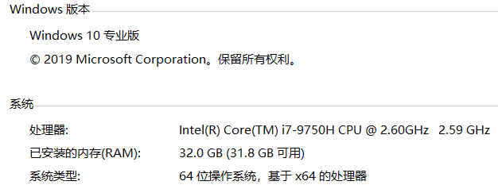

## java训练营week02

### 各gc垃圾收集特性测试总结
总的说来，具体使用哪种gc需要综合机器的物理内存，应用的性能需求，各gc的特性等多方面综合考虑。
另外有几小点做下总结
- 设置满足条件的gc需要实际去进行测试
- 避免的一个误区是gc堆设置的越大越好，gc堆越大，单次full gc占据的时间可能很长，可能引起性能抖动。如果可获得相同性能及吞吐量，尽量设置为小的内存。
- Serial GC是单线程gc，gc时对应用影响大，适用于小内存应用。
- Parallel gc是多线程gc，gc对应用影响大，对吞吐量要去较大时可以选择。
- CMS gc gc暂停时间相对较短，适用对性能要求高的应用。
- G1 gc在大内存时表现优异。
- jdk 8默认Paralle gc, jdk9以上去除CMS gc，默认是用G1 gc。

### 各gc垃圾收集特性测试数据汇总
测试机器   


测试命令
- java -Xmx256m -Xms256m -XX:+UseSerialGC -XX:+PrintGCApplicationStoppedTime -XX:+PrintGCDetails -XX:+PrintGCDateStamps GCLogAnalysis
- java -Xmx256m -Xms256m -XX:+UseParallelGC -XX:+PrintGCApplicationStoppedTime -XX:+PrintGCDetails -XX:+PrintGCDateStamps GCLogAnalysis
- java -Xmx256m -Xms256m -XX:+UseConcMarkSweepGC -XX:+PrintGCApplicationStoppedTime -XX:+PrintGCDetails -XX:+PrintGCDateStamps GCLogAnalysis
- java -Xmx256m -Xms256m -XX:+UseG1GC -XX:+PrintGCApplicationStoppedTime -XX:+PrintGCDetails -XX:+PrintGCDateStamps GCLogAnalysis

| 设定测试时间(s) | xmx  | xms  |  gc名称  |  共生成对象次数:  |  堆内存分布     |
|  :-- | :-- | :--  | :--   |  :-- |   :-- | 
|   1   |  256m   |  256m   |  Serial     |   4457,4454,4897,4273,4060     | def new gerneration:76.8m(eden 68.3m（88.9%） from，to: 8.5m ) 堆(247.5m, new ger(76.8m， 31%), tenured generation:(170.69m))      |
|   1   |  256m   |  256m   |  Parallel    |     OOM,OOM,3248,OOM,OOM     | psyounggen(57m eden:29m from,to:28m), 堆（228m young:57m 占25% old:(171m))        |
|   1   |  256m   |  256m   |  ConcMarkSweep     | 4343, 4477,4590,4319,4508  | par new(76.8m, eden:68.3m ) concurrent mark-sweep generation(170.7m)       |
|   1   |  256m   |  256m   |  G1       |  1618,1667,2129,2017,2236     |garbage-first heap(256m)  region size 1024K, 4 young (4096K), 3 survivors (3072K) 
|   1   |  512m   |  512m   |  Serial    |   11294,11775,11295,11086,11771     | def new gerneration:153.6m(eden 136.5m（88.9%） from，to: 17.1m ) 堆(494.9m, new ger(153.6m， 31%)) tenured generation(341.3m)      |
|   1   |  512m   |  512m   |  Parallel    |  9277,8901,9685,9092,8559     | psyounggen(114m eden:57.5m from,to:56.5m), 堆（455.5m young:114m 占25% old:(341.5m))        |
|   1   |  512m   |  512m   |  ConcMarkSweep   | 11228, 10694,11233,11057,11146  | par new(153.6m, eden:136.5m ) concurrent mark-sweep generation(341.4m) 堆（495m parnew 153.6m 占31%）      |
|   1   |  512m   |  512m   |  G1    |   7169,6873,7112,6924,8031     |garbage-first heap(256m)  region size 1024K, 4 young (4096K), 3 survivors (3072K) 
|   1   |  1g   |  1g   |  Serial    |    15735,14981,15216,14752,14773     | 
|   1   |  1g   |  1g   |  Parallel    |     17079,17230,17525,17255,17662     | 
|   1   |  1g   |  1g   |  ConcMarkSweep    | 16291, 16046,16862,16716,16940  
|   1   |  1g   |  1g   |  G1     |  14319,13806,15711,14207,16488     |
|   1   |  2g   |  2g   |  Serial     |   14784,14791,14609,14169,14747     | 
|   1   |  2g   |  2g   |  Parallel    |   20108,19838,19271,19752,19842     | 
|   1   |  2g   |  2g   |  ConcMarkSweep   | 15585, 15783,14717,17630,15633  
|   1   |  2g   |  2g   |  G1    |  16528,11944,17872,14174,13598     |
|   1   |  4g   |  4g   |  Serial     |   12844,12633,12648,12612,12714     | 
|   1   |  4g   |  4g   |  Parallel       |   19362,19215,18884,18896,18692     | 
|   1   |  4g   |  4g   |  ConcMarkSweep         | 15574, 17585,15564,17152,15397  
|   1   |  4g   |  4g   |  G1          |  19392,16848,18663,14210,15406     |
|   1   |  8g   |  8g |   Serial    |     8284,8270,8259,8400,8346     | 
|   1   |  8g   |  8g   |  Parallel    |      9090,9317,8047,7883,8689     | 
|   1   |  8g   |  8g   |  ConcMarkSweep      | 15518, 15333,15610,15400,15445  
|   1   |  8g   |  8g   |  G1         |  20401,19710,20196,19893,20135     |


### 各gc垃圾收集特性测试基于的示例
```java
import java.util.Random;
import java.util.concurrent.TimeUnit;
import java.util.concurrent.atomic.LongAdder;
/*
演示GC日志生成与解读
*/
public class GCLogAnalysis {
    private static Random random = new Random();
    public static void main(String[] args) {
        // 当前毫秒时间戳
        long startMillis = System.currentTimeMillis();
        // 持续运行毫秒数; 可根据需要进行修改
        long timeoutMillis = TimeUnit.SECONDS.toMillis(1);
        // 结束时间戳
        long endMillis = startMillis + timeoutMillis;
        LongAdder counter = new LongAdder();
        System.out.println("正在执行...");
        // 缓存一部分对象; 进入老年代
        int cacheSize = 2000;
        Object[] cachedGarbage = new Object[cacheSize];
        // 在此时间范围内,持续循环
        while (System.currentTimeMillis() < endMillis) {
            // 生成垃圾对象
            Object garbage = generateGarbage(100*1024);
            counter.increment();
            int randomIndex = random.nextInt(2 * cacheSize);
            if (randomIndex < cacheSize) {
                cachedGarbage[randomIndex] = garbage;
            }
        }
        System.out.println("执行结束!共生成对象次数:" + counter.longValue());
    }

    // 生成对象
    private static Object generateGarbage(int max) {
        int randomSize = random.nextInt(max);
        int type = randomSize % 4;
        Object result = null;
        switch (type) {
            case 0:
                result = new int[randomSize];
                break;
            case 1:
                result = new byte[randomSize];
                break;
            case 2:
                result = new double[randomSize];
                break;
            default:
                StringBuilder builder = new StringBuilder();
                String randomString = "randomString-Anything";
                while (builder.length() < randomSize) {
                    builder.append(randomString);
                    builder.append(max);
                    builder.append(randomSize);
                }
                result = builder.toString();
                break;
        }
        return result;
    }
}
```


